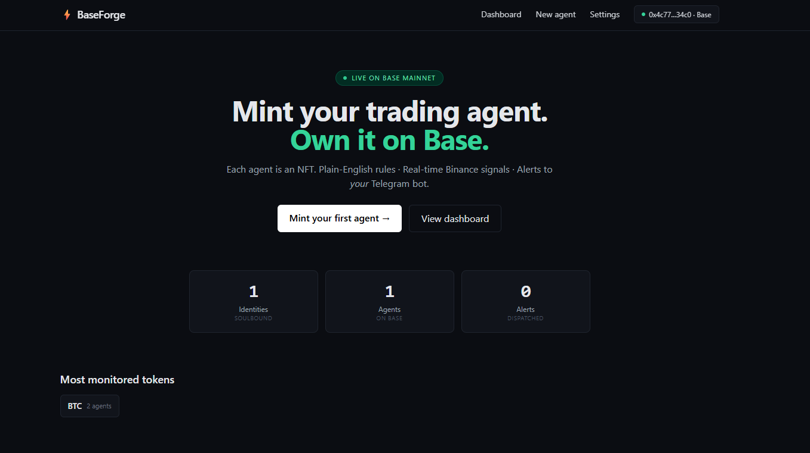
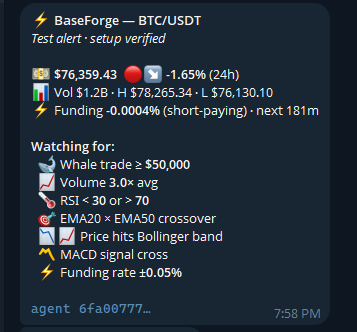
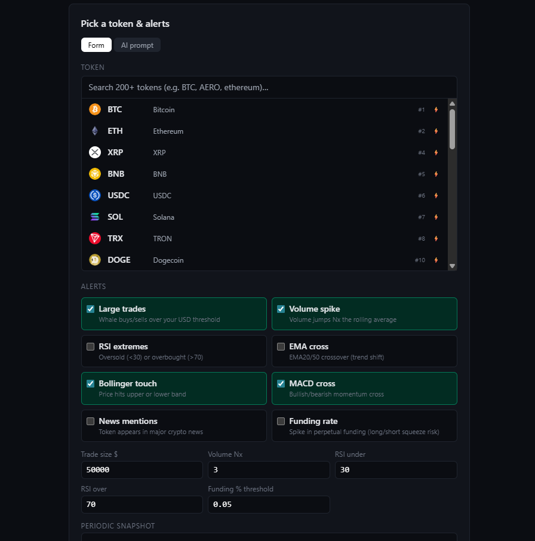

# BaseForge

**Mint your trading agent. Own it on Base.**

Each alert agent is an NFT on Base mainnet. Bring your own Telegram bot,
bring your own LLM key — BaseForge runs a real-time monitor on Binance
and pushes alerts to *your* bot.



---

## What it does

- **Real-time monitoring** of any Binance-listed token (200+ pre-seeded incl. AERO, BRETT, DEGEN)
- **Alert types** — large trades, volume spikes, RSI extremes, EMA crosses, Bollinger touch, MACD cross, funding-rate spikes, news mentions
- **AI-enriched messages** — every alert includes 24h ticker, funding rate, and a 2-sentence Kimi LLM market commentary
- **NFT-backed** — each agent is an ERC-721 on Base. Transfer, sell, or hold
- **Bring your own Telegram bot** — you create the bot via @BotFather, BaseForge sends through it. You can use a different bot per agent if you want
- **Bring your own LLM key** — Kimi by default, also OpenAI / Claude
- **Periodic snapshots** — set 5-minute through 24-hour intervals for scheduled reports

---

## How it looks

### Telegram alert

Each alert is rich and self-contained: live price, 24h change, volume,
funding rate, AI commentary, list of rules being watched, and inline
action buttons (snooze, stop the agent, open dashboard).



### Create an agent

The wizard is short — 3 steps after wallet connect: pick a token, choose
which alerts to fire, set thresholds. You can also paste a different
bot token at this step if you want this agent to alert via a separate bot.



---

## How it works

```
┌──────────┐   1. Mint Identity NFT (free)
│  Wallet  │   2. Mint Agent NFT with config (1 tx)
└────┬─────┘
     │
     ▼
┌─────────────┐  Web (Next.js, Vercel)
│  baseforge  │  - Wizard, dashboard, edit, NFT metadata API
│     web     │  - Cached on-chain reads
└─────┬───────┘
      │ POST /agents
      ▼
┌──────────────┐  Agent service (Python FastAPI, systemd on VPS)
│  monitor     │  - Binance WebSocket per token
│  service     │  - Indicator computation (pandas-ta)
└─────┬────────┘  - Periodic reporter loop
      │           - News poller (CoinGecko)
      │ alert
      ▼
┌──────────────┐  Your Telegram bot
│  user's bot  │  Pushes message to user's chat
└──────────────┘
```

**Real-time:** large trades + volume spikes fire instantly when Binance WebSocket emits a matching event.
**Per-candle:** RSI / EMA / Bollinger / MACD recompute on each closed 1-minute candle.
**News:** CoinGecko news polled every 5 minutes.
**Dedup:** the same alert type won't fire more than once per 30 seconds.

---

## Tech stack

| Layer | Stack |
|---|---|
| Web | Next.js 15 (App Router), TypeScript, Tailwind, wagmi v2 |
| Wallet | Coinbase Wallet, MetaMask, OKX, Trust, WalletConnect — all Base mainnet |
| Contracts | Solidity 0.8.24, OpenZeppelin v5, Hardhat |
| Storage | Supabase (Postgres + RLS) |
| NFT metadata | IPFS via Pinata + dynamic JSON API |
| Agent service | Python 3.13, FastAPI, asyncio, websockets |
| LLM | Kimi (Moonshot) by default, OpenAI/Claude optional |
| Hosting | Vercel (web), VPS systemd (agent service) |

---

## Quick start (local dev)

### 1. Web app
```bash
cd web
pnpm install
cp .env.example .env.local   # fill Supabase URL + keys
pnpm dev                     # http://localhost:3013
```

### 2. Agent service
```bash
cd agent
pip install -r requirements.txt
export AGENT_SERVICE_TOKEN=local-test
export ENCRYPTION_KEY=$(openssl rand -base64 32)
python -m service            # http://localhost:8200
```

### 3. (Optional) Deploy contracts to Base
```bash
cd contracts
npm install
DEPLOYER_PRIVATE_KEY=0x... npx hardhat run scripts/deploy.ts --network baseMainnet
# Update web/.env.local with the printed addresses
```

---

## Deployed contracts (Base mainnet)

- **BaseForgeIdentity** (soulbound, 1 per wallet) — [`0x8c134df21b0ce82e6e0a2fef6715e3525ccc4759`](https://basescan.org/address/0x8c134df21b0ce82e6e0a2fef6715e3525ccc4759#code)
- **BaseForgeAgent** (transferable per-agent NFT) — [`0xa7e0c1e5a08a0174ab92caaf95e9d6a46edaed3b`](https://basescan.org/address/0xa7e0c1e5a08a0174ab92caaf95e9d6a46edaed3b#code)

Both verified on BaseScan + Sourcify.

---

## License

MIT
